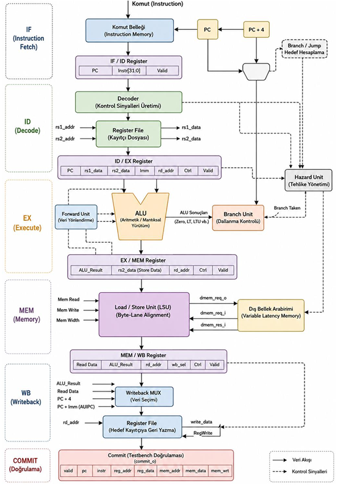

[TR]
32-bit RISC-V (RV32I), klasik 5 Aşamalı Pipeline

Bu proje, RV32I komut setini ve özel bit manipülasyon komutlarını (CLZ, CTZ, CPOP) destekleyen, 5 aşamalı boru hattına (pipeline) sahip çok çevrimli bir RISC-V işlemci çekirdeğidir.SystemVerilog ile tasarlanmış ve Verilator ile doğrulanmıştır.

## Özellikler

* **Mimari:** 32-bit RISC-V (RV32I), klasik 5 Aşamalı Pipeline (Fetch, Decode, Execute, Memory, Writeback).
* **Ek Komutlar:** Donanımsal olarak sentezlenebilir `CLZ`,`CTZ` ve `CPOP` bit manipülasyon desteği.
* **Kritik Yol (Critical Path) Optimizasyonu:** Dallanma kararları ALU'dan bağımsız paralel bir donanım bloğunda hesaplanarak maksimum çalışma frekansı (Fmax) artırılmıştır.
* **Gelişmiş Tehlike Yönetimi (Hazard Management):** 
  * Veri bağımlılıklarını sıfır gecikmeyle çözen **Forwarding Unit** (EX->EX ve MEM->EX yönlendirmeleri).
  * Load-Use veri tehlikelerini algılayan ve boru hattını donduran **Hazard Unit** .
  * *False Stall Koruması:* Komutların kaynak yazmaç (rs1/rs2) kullanımlarını dinamik analiz ederek gereksiz boru hattı duraklamalarını engelleyen mikro mimari optimizasyonu.
  * Dallanma gerçekleştiğinde yanlış getirilen komutları silen donanımsal **Flush** mekanizması.
* **Değişken Gecikmeli Bellek:** Dış belleğin gecikmelerine asenkron olarak uyum sağlayan ve boru hattını güvenle kilitleyen el sıkışma (valid/busy) arayüzü.

## Mimari Blok Şeması



## Dizin Yapısı

```text
├── src/                    # SystemVerilog RTL kodları
│   ├── pkg/                # Paket ve enum tanımlamaları
│   ├── branch_unit.sv      # Paralel dallanma karar modülü
│   ├── forward_unit.sv     # Veri yönlendirme ve bypass
│   ├── hazard_unit.sv      # Stall ve Flush kontrolü
│   ├── load_store_unit.sv  # Bellek bayt hizalama 
│   ├── riscv_alu.sv        # Aritmetik ve Bitmanip işlem birimi
│   ├── riscv_decoder.sv    # Komut çözümleme
│   └── riscv_multicycle.sv # Ana işlemci ve Pipeline kayıtçıları
├── tb/                     # Testbench ve Bellek modelleri
├── tests/                  # Doğrulama test senaryoları 
├── check_result.py         # Altın model karşılaştırma betiği
├── Makefile                # Otomasyon betiği
└── README.md               # Proje dokümantasyonu
```

## Kurulum ve Gereksinimler

Projenin derlenmesi, simülasyonu ve dalga formu analizi için Linux veya Windows üzerinde WSL ortamı gerekmektedir.

**1. WSL/Ubuntu Kurulumu (Yalnızca Windows Kullanıcıları İçin):**
Eğer Windows kullanıyorsanız PowerShell'i yönetici olarak çalıştırıp şu komutu girin:

```powershell
wsl --install -d Ubuntu
```

Kurulum tamamlandıktan sonra Başlat menüsünden Ubuntu uygulamasını açarak Linux terminaline geçiş yapın.

**2. Gerekli Paketlerin Yüklenmesi:**
Ubuntu terminalinizde aşağıdaki komutu çalıştırarak C++ derleyicisi, Verilator, Python ve GTKWave araçlarını kurun:

```bash
sudo apt update
sudo apt install -y verilator build-essential python3 gtkwave
```

## Simülasyon ve Doğrulama

Projede yer alan test paketleri Makefile aracılığıyla Verilator kullanılarak derlenir. Python tabanlı `check_result.py` betiği, işlemcinin ürettiği donanımsal çıktıları altın referans ile satır satır karşılaştırarak doğrulama yapar.

İşlemlere başlamadan önce projenin bulunduğu dizine terminalden gidin:

```bash
cd /projenin/bulundugu/dizin
```

**Temel RV32I Komut Setini Test Etmek İçin (Base Test):**

```bash
make clean
make TEST=base_test
```

**Bellek Okuma/Yazma ve Bayt Hizalamasını Test Etmek İçin (Memory Test):**

```bash
make clean
make TEST=memory_test
```

*(Her iki testin de sonunda terminal ekranında `%100 - All tests passed!` mesajı görülmelidir.)*

## Dalga Formu Analizi

Testleri çalıştırdıktan sonra üretilen `dump.vcd` dosyasını görselleştirmek ve sinyalleri (pipeline aşamaları, forwarding durumları, memory valid/busy döngüleri) incelemek için:

```bash
make wave
```

## Kod Kapsamı (Coverage) Raporu

İşlemcinin hangi kod satırlarının ve dallanmalarının test edildiğini gösteren HTML tabanlı detaylı kapsam raporunu üretmek için:

```bash
make cov
```

Bu komut sonucunda `logs/html/index.html` adında bir rapor dosyası üretilir. Bu dosyayı tarayıcınızda açarak simülasyonun kod üzerindeki etkisini inceleyebilirsiniz.
> 📄 Detaylı mikro mimari analizleri, dalga şekilleri (waveform) ve doğrulama raporu için [Tasarım Raporu](Design_Report_TR_Burak_Karapinar.pdf) belgesini inceleyebilirsiniz.

[EN]
This project is a multi-cycle RISC-V processor core with a 5-stage pipeline, supporting the RV32I instruction set and custom bit manipulation instructions (CLZ, CTZ, CPOP). It is designed in SystemVerilog and verified with Verilator.

### Features

* **Architecture:** 32-bit RISC-V (RV32I), classic 5-Stage Pipeline (Fetch, Decode, Execute, Memory, Writeback).
* **Additional Instructions:** Hardware-synthesizable `CLZ`, `CTZ`, and `CPOP` bit manipulation support.
* **Critical Path Optimization:** Branch decisions are calculated in a parallel hardware block independent of the ALU, increasing the maximum operating frequency (Fmax).
* **Advanced Hazard Management:** 
  * **Forwarding Unit** that resolves data dependencies with zero delay (EX->EX and MEM->EX forwarding).
  * **Hazard Unit** that detects Load-Use data hazards and stalls the pipeline.
  * *False Stall Protection:* Microarchitectural optimization that dynamically analyzes the use of source registers (rs1/rs2) by instructions to prevent unnecessary pipeline stalls.
  * Hardware **Flush** mechanism that clears incorrectly fetched instructions when a branch is taken.
* **Variable Latency Memory:** Handshake (valid/busy) interface that asynchronously adapts to external memory delays and safely locks the pipeline.

### Architectural Block Diagram


### Directory Structure

```text
├── src/                    # SystemVerilog RTL codes
│   ├── pkg/                # Package and enum definitions
│   ├── branch_unit.sv      # Parallel branch decision module
│   ├── forward_unit.sv     # Data forwarding and bypass
│   ├── hazard_unit.sv      # Stall and Flush control
│   ├── load_store_unit.sv  # Memory byte-lane alignment 
│   ├── riscv_alu.sv        # Arithmetic and Bitmanip execution unit
│   ├── riscv_decoder.sv    # Instruction decoding
│   └── riscv_multicycle.sv # Main processor and Pipeline registers
├── tb/                     # Testbench and Memory models
├── tests/                  # Verification test scenarios 
├── check_result.py         # Golden model comparison script
├── Makefile                # Automation script
└── README.md               # Project documentation
```

### Installation and Requirements

A Linux or Windows WSL environment is required for compiling, simulating, and analyzing the waveforms of the project.

**1. WSL/Ubuntu Installation (For Windows Users Only):**
If you are using Windows, run PowerShell as an administrator and enter the following command:

```powershell
wsl --install -d Ubuntu
```

Once the installation is complete, open the Ubuntu application from the Start menu to switch to the Linux terminal.

**2. Installing Required Packages:**
Run the following command in your Ubuntu terminal to install the C++ compiler, Verilator, Python, and GTKWave tools:

```bash
sudo apt update
sudo apt install -y verilator build-essential python3 gtkwave
```

### Simulation and Verification

The test packages in the project are compiled using Verilator via the Makefile. The Python-based `check_result.py` script verifies the generated hardware outputs by comparing them line-by-line with the golden reference.

Before starting, navigate to the project directory from your terminal:

```bash
cd /path/to/project/directory
```

**To Test the Basic RV32I Instruction Set (Base Test):**

```bash
make clean
make TEST=base_test
```

**To Test Memory Read/Write and Byte Alignment (Memory Test):**

```bash
make clean
make TEST=memory_test
```

*(At the end of both tests, the message `%100 - All tests passed!` should be seen on the terminal screen.)*

### Waveform Analysis

To visualize the generated `dump.vcd` file after running the tests and examine the signals (pipeline stages, forwarding states, memory valid/busy cycles):

```bash
make wave
```

### Code Coverage Report

To generate an HTML-based detailed coverage report showing which lines of code and branches of the processor were tested:

```bash
make cov
```

This command produces a report file named `logs/html/index.html`. You can open this file in your browser to examine the simulation's impact on the code.
> 📄 For detailed microarchitectural analysis, waveforms, and test results, please refer to the [Design Report (EN)](Design_Report_EN_Burak_Karapinar.pdf).
